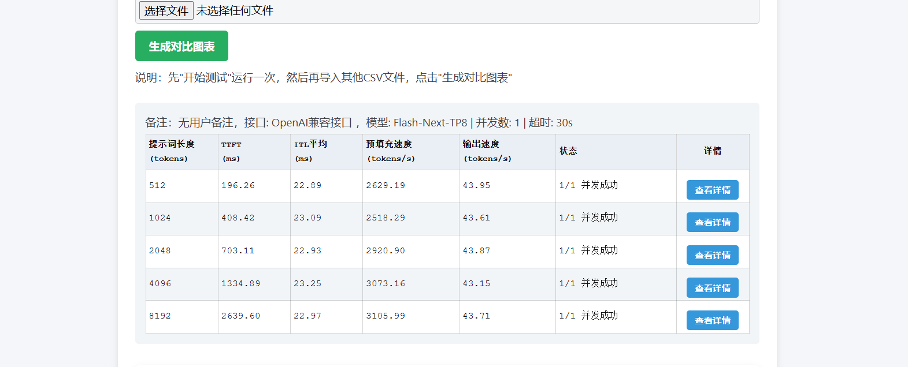
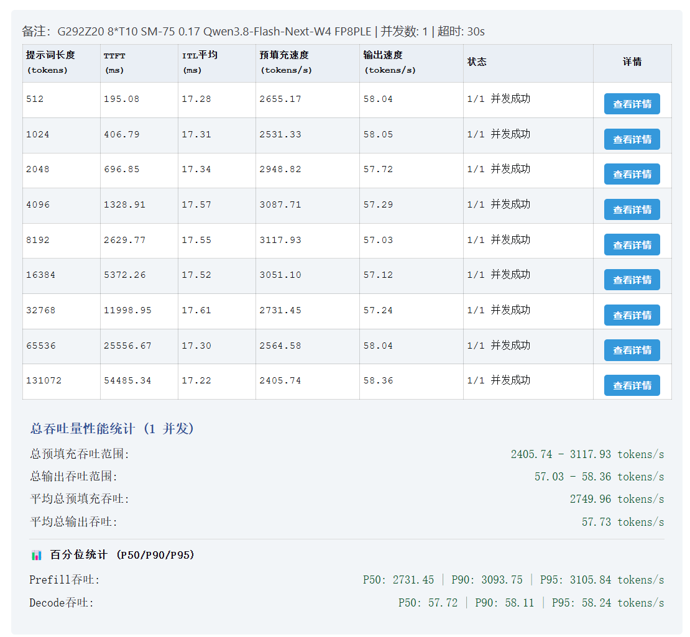

# vLLM-SM75 0.1.7 自包含部署包（G292-Z20 / 8 × Tesla T10 / sm_75）

包版本 **v1.0**（2026-10-07）｜对应上游 **vLLM-SM75 0.1.7-beta**（upstream vLLM 0.30.0、Torch 2.13.0+cu129、CUDA 12.9、FlashInfer 0.6.18、Node 22.23.2）

这个包解决一件事：在这台 8 卡 T10 的机器上，把 Flash-Next 27B/48层 MoE 档（TP8＋EP、256K 上下文、FP8 KV、QSA 全开、无 MTP）从"能跑"做到"跑满"，并且**每一步都有可复核的断言**，不留"照着文档跑不通"的坑。

---

## 一、先看实测效果

同一台机、同一个 profile、同一把尺（Ultra 控制台自带「模型测试」，llm_speedtest 扩展 commit `eb19940`，并发 1、超时 30 s），唯一差别是镜像多了一层 FlashInfer PCIe-IPC 回填＋一个环境变量。

基线（后端 FIREFLY_AR，2026-10-07 14:0x，5 个提示词长度 512→8192）：



生产档（后端 FLASHINFER_PCIE_IPC，2026-10-07 14:3x，9 个长度 512→131072）：



| 指标 | 基线 FIREFLY_AR（5 档） | 生产档 PCIe-IPC | 变化（同长度逐档配对） |
|---|---|---|---|
| ITL（步时） | 22.89–23.25 ms | **17.22–17.61 ms** | 每步省 ≈5.5 ms |
| 输出 tok/s | 43.15–43.95 | **57.03–58.36**（均值 57.73） | **＋30.5%～＋33.1%** |
| 预填充 tok/s | 2518.29–3105.99 | 2531.33–3117.93 | ＋0.4%～＋1.0%（噪声内） |
| TTFT | 196.26 / 408.42 / 703.11 / 1334.89 / 2639.60 | 195.08 / 406.79 / 696.85 / 1328.91 / 2629.77 | −0.4% |

可比长度只有 512–8192 这五档（基线那批只跑了 5 个长度，16384 以上是新加的档，不参与配对差）；
逐档配对的输出吞吐增幅依次是 512→＋32.1%、1024→＋33.1%、2048→＋31.6%、4096→＋32.8%、8192→＋30.5%。

用官方随包尺子（源码树 tools 目录里的 benchmark_flash_next.py）复核过 8K 档：decode 中位 44.55 → **58.01**（n=7，区间 57.72–58.61，＋30.2%），prefill 3215.44 → 3214.54（−0.03%），`passed=true`、零抢占、零缓存命中、无投机。
两批数据的完整九行表与判读见 **`docs/实测-面板测速对照-v1.md`**。

**为什么不是"提频"或"解锁功率墙"**：两次 SM 时钟都是 1590 MHz（T10 跑满档），单卡功耗从约 90 W 升到约 118 W，而每 token 能量几乎不变（2.06 → 2.03 J，**这两个数是"功耗 ÷ 吞吐"算出来的计算值、不是仪器实测**）⇒ 功耗上涨完全由"每秒多做 31% 的步"解释。省下来的 5.5 ms 与上下文长度无关，正是"每步一次 allreduce"的形状。
基线那侧的单卡功耗来自 2026-10-07 面板性能监控页的逐卡读数 87.8–92.5 W（同页作废过一个"八卡合计 89 W"的旧采样，那是 awk 读错列，两者不是一回事，别混引）。

---

## 二、四步上手

```bash
# 1) 构建镜像（层0 官方 ultra → 层1 GPU 探测超时 20s → 层2 PCIe-IPC 回填）
bash docker/build.sh                       # 已有官方基座时它只补层1、层2

# 2) 环境体检 + 起容器（路径用同名环境变量覆盖，绝不写死在脚本里）
bash run/env-check-v1.sh /path/to/model-dir          # 有 BLOCK 就非零退出，别跳过
DATA=/path/to/console-data MODELS=/path/to/model-dir \
  bash run/start-here-v1.sh --dry-run                # 先看组装出来的 docker run（零副作用）
DATA=/path/to/console-data MODELS=/path/to/model-dir \
  bash run/start-here-v1.sh                          # 门禁全 PASS 才真起

# 3) 给档加那个环境变量（不加就还是 FIREFLY_AR，+31% 拿不到）
docker exec <容器> node /console-data/tmp/console-edit-profile-v1.cjs <profileId> \
  setenv VLLM_ALLREDUCE_USE_FLASHINFER_PCIE_IPC 1
# 也可以直接用包里的推荐档模板 run/profiles/flash-next-tp8-256k-nomtp-pcieipc.json
# （官方档 ＋ 那一条 env；官方原样档保留为基线，两份的差集就那一行）

# 4) 起引擎并复验签名（面板点「启动」，或命令行）
docker exec <容器> node /console-data/tmp/console-driver-v1.cjs probe      # 现取 profileId
docker exec <容器> node /console-data/tmp/console-driver-v1.cjs start <profileId>
```

`tools/panel/` 那两个 `.cjs` 是面板的命令行驱动，`start-here-v1.sh` 会把它们拷到 `$DATA/tmp/`（= 容器内 `/console-data/tmp/`）。**不随包发就等于让复刻的人只能去网页上手点**，所以这一步是发布阻塞项。

判成功的终态（不是"命令 rc=0"）：

- 引擎日志里 `Using ['FLASHINFER_PCIE_IPC', 'FIREFLY_AR', 'PYNCCL'] … for group 'tp:0'` —— 后端进了**第一位**；
- 有 `Initialized FlashInfer PCIe IPC all-reduce`，且**没有** `does not provide PcieIpcAllReduceWorkspace`；
- `GPU KV cache size: 339,110 tokens`、`FP8 layout verified` 恰好 **96 条**（12 个 full_attention 层 × 8 worker）、`backend=p2p` 8 条、无 `Traceback`。

---

## 三、包里有什么

```
README.md                        本文件
部署文档-v1.md                    逐步操作与判据
基线与口径说明-v1.md               基线值、本机漂移项、测速口径红线
CHANGELOG.md                     版本沿革（这个包是 v1.0，对应上游 0.1.7-beta）
LICENSE  NOTICE  SHA256SUMS.txt
run/
  start-here-v1.sh               唯一启动入口（含共存门、端口门、终态断言）
  env-check-v1.sh                硬件/驱动/磁盘/内存/权重/拓扑体检（有 BLOCK 非零退出）
  profiles/flash-next-tp8-256k-nomtp.json               官方 0.1.7 模板原样（默认值＝基线）
  profiles/flash-next-tp8-256k-nomtp-pcieipc.json       推荐档＝官方模板＋那一条 env（差的就那一行）
docker/
  build.sh                       唯一构建入口（三层，任一层可跳；SKIP_NVAPI/SKIP_PCIEIPC 是真开关）
  Dockerfile.to20s-v1  to20s-patch-v2.sh    层1：面板 GPU 探测超时 3s→20s
  Dockerfile.pcieipc-v1                     层2：PCIe-IPC 回填层
  pcieipc/                                  回填物料：6 个新文件＋3 个追加块＋manifest＋门禁脚本＋解包器
  libnvidia-api.so.1  NVAPI-获取说明-v1.md  P-State 需要的宿主库（只读 bind，不烘进镜像）
tools/
  panel/console-driver-v1.cjs               面板命令行驱动（probe/setup/start/stop/status/engineenv）
  panel/console-edit-profile-v1.cjs         带护栏地改档（setenv/rmenv/setarg，逐项比对＋异常回滚）
  flash-next-tested.sha256  sha256-weights-v1.sh   权重全量校验（34 项＝15 主＋10 plefp8＋9 其它）
  gen-console-env-v1.sh                             把在役容器 env 落成宿主 600 文件
  bench-official-v1.sh                              官方随包尺子的封装（口径钉死＋可比性判定）
  lint-package-v1.sh                                出厂自检（语法/行尾/反泄露/断链/清单）
docs/                             实测对照与截图、给他人 AI 的自包含提示词
```

---

## 四、默认值与两处破例（必须读）

包内 profile 模板是**官方 0.1.7 档原样**（MMBT 4096、util 0.92、`--kv-cache-memory-bytes 2415919104`、`--block-size 16`、`qwen3_xml`、`--compilation-config PIECEWISE`、QSA 一组 env），遵循"分享包默认值锁原始基线"的规矩；我们这台机的差异只写进 `基线与口径说明-v1.md` 的漂移项，不改包内默认。

端口也一样：`API_PORT` 默认 **8000**（官方文档口径），我们本机用的 18001 是漂移项，不默认发出去。

**两处破例**（都写在这里，别假装没有）：

1. `run/profiles/flash-next-tp8-256k-nomtp-pcieipc.json` 是"官方模板＋`VLLM_ALLREDUCE_USE_FLASHINFER_PCIE_IPC=1`"的推荐档；官方原样那份仍是基线，两份逐字节只差这一条 env。发它的原因是：光有镜像那一层、档里不置这个变量，vLLM 默认不启用该后端，+31% 拿不到。
2. `docker/build.sh` 默认会产出并推荐带 PCIe-IPC 回填层的镜像。理由是该增益在这台机上量级明确（decode ＋30.5%～＋33.1%）且可一键退回。请知悉三点：
   1. 这层是**我们自维护**的：把 FlashInfer 0.7.0.post1 里的 6 个文件与 3 处导出补进已装的 0.6.18，**不升级 FlashInfer、不动 attention 内核与 cubin**。官方产物点不亮这个后端（官方镜像同样钉 0.6.18）。
   2. 退回官方形态只要一条命令：`SKIP_PCIEIPC=1 bash docker/build.sh`，或启动时不置 `VLLM_ALLREDUCE_USE_FLASHINFER_PCIE_IPC`（也别用上面那份推荐档）。
   3. 上游 FlashInfer 一旦带上 `PcieIpcAllReduceWorkspace`（0.7 起自带），**这层应当撤除**，不要长期叠加。

---

## 五、基线前提

| 项 | 要求 | 说明 |
|---|---|---|
| GPU | 8 × Tesla T10（sm_75，16 GiB），纯 PCIe 无 NVLink | 其他 sm_75 卡需重测常量 |
| 驱动 / CUDA | ≥ 570，CUDA 12.9 | 引擎内 CUDA，不依赖宿主 toolkit |
| 宿主内存 | ≥ 128 GiB 可用；容器内存上限按官方文档 112 GiB | 权重加载峰值实测 110.7/112 GiB，**别调低** |
| 磁盘 | 权重约 124 GiB；根盘余量 ≥ 40 GiB | 大构建前先现采 `df` |
| 权重 | 官方 tested 修订（`tools/flash-next-tested.sha256` 34 项全对＝15 主分片＋10 plefp8＋9 其它） | 权重不同则所有数字不可与本包对照 |
| 面板两处必修 | ① GPU 探测超时 3s→20s；② NVAPI 只读 bind | 缺①面板报「无法读取 GPU 状态」HTTP 400 拒启；缺②面板拒绝启引擎 |

---

## 六、已知坑（我们都踩过，写在这里省你时间）

1. **别整体升级到 FlashInfer 0.7**。官方镜像钉 0.6.18 有明确理由（AOT cubins 不含 SM75 会让 BatchPrefill 在图预热时失败），升版本面太大。回填只动 9 个文件。
2. **追加块的验收不能用"某字符串出现一次"计数**。`comm/__init__.py` 里同一句 import 本来出现 3 次，计数断言会把好构建判成失败。正确判据是"目标文件必须以该块内容逐字结尾"（`docker/pcieipc/gate-check-v3.py` 就是这么做的）。
3. **`pcie_ipc_all_reduce_trace` 依赖同文件两个辅助函数**。只抄 `TraceTemplate(...)` 赋值那句，`import flashinfer` 会直接 NameError，整条推理路径当场死。
4. **判"某符号在不在"要用 AST 收全部顶层绑定**。`register_custom_op` 藏在 `utils.py` 的 if/else 两分支里、`autotuner` 是包目录不是文件——按文本或按 `.py` 路径去找都会误报"缺失"，进而多补砖头。
5. **直接 `docker run 镜像 vllm serve …` 会被吞**。派生镜像继承的是 node 控制台 entrypoint，必须显式 `--entrypoint`。任何要等十分钟以上的动作，前面加一条 30–90 秒的"形状自检"（起格后必须看到目标进程）。
6. **JIT 缓存要挂到宿主**。首次启用该后端会现场 nvcc 编译（本机冷缓存实测 9.1 秒，不用预留几分钟），但 `/root/.cache`、`/root/.triton`、`/root/.nv`、`/root/.tilelang` 四条 bind 少一条，重建容器就重付编译费。`/root/.tilelang` 尤其容易漏（它不在常见三条里）。
7. **`docker diff` 查可写层比"我设过 env 了"可靠**。缓存类 env 设了不等于落在持久化目录里，验收要看 diff 还有没有新增。
8. **面板 profile 日志跨次追加**。任何计数类判据（FP8 layout 96、p2p 8）必须只取本次启动新增的字节切片，否则会翻倍。
9. **端口默认只绑 127.0.0.1**。要局域网访问得显式 `BIND_HOST=0.0.0.0` 重跑，并且自己加上鉴权（档里给引擎配 `--api-key`，或前置反代）——本包不会替你把无鉴权的推理端口发到公网上。
10. **env 覆盖口用分号不用逗号**。`BOOTSTRAP_ENV` 里 `PSTATE_GPUS=0,1,2,3,4,5,6,7` 这种含逗号的值是常态，拿逗号当分隔符会把值切碎，碎出来的 `-e 1` 变成"透传宿主变量 1"＝静默丢值。脚本切完还逐片验形状，不合规直接 BLOCK。

---

## 七、撤除与回滚

```bash
# 撤回填层（保留 20s 层）
SKIP_PCIEIPC=1 bash docker/build.sh
# 撤 profile 里那个变量（工具会逐字段＋逐 argv 位比对，异常自动回滚）
docker exec <容器> node /console-data/tmp/console-edit-profile-v1.cjs <profileId> \
  rmenv VLLM_ALLREDUCE_USE_FLASHINFER_PCIE_IPC
```

启动入口自带共存门：**同一份 `/console-data` 只允许一个控制台实例使用**（否则 `profiles.json` 会被整体重写覆盖），端口被占、八卡未空、NVAPI 哈希不符都会直接拦下；**门禁没过时脚本一次写操作都不做**（不建目录、不 chmod、不拷文件、不起容器），`--dry-run` 更是全程只读。
同名容器不会被自动删——要复用名字就自己 `docker rm`，或换个 `NAME=`。

不用 P-State 托管（不想带那个 NVIDIA 库）就两处一起改：`SKIP_NVAPI=1 bash docker/build.sh` ＋ `NVAPI=none bash run/start-here-v1.sh`，并把档里 `power.mode` 从 `pstate` 改成 `sleep`。只改一处会出现"构建过了、面板拒启"。

---

## 八、许可与第三方二进制

代码部分沿用上游许可（见 `LICENSE` 与 `NOTICE`）。`docker/libnvidia-api.so.1` 是 NVIDIA 驱动侧运行库，仅为让 P-State 托管在这台机上可用而随包附送（sha256 `4a199f9b…131d8c`，720104 字节，驱动 580.173.02）；它**不烘进镜像**，是宿主侧只读 bind。不需要 P-State 就按 `docker/NVAPI-获取说明-v1.md` 走 sleep 退路（`SKIP_NVAPI=1` ＋ `NVAPI=none`）。
包内**不含任何凭据**：登录 token 与引擎 API key 都在运行时生成、落在 `$DATA`（脚本会 `chmod 700`），不要外发那个目录。`tools/panel/*.cjs` 读 token 只进请求头，任何输出都把含 key/token/secret 的名字脱敏。
